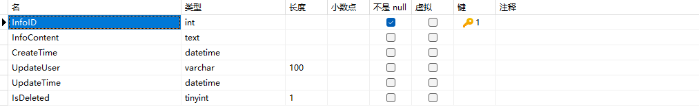

对应数据库表结构如下：

基本功能：

|      | 从后端角度来看             | 从前端角度来看                                               |
| :--- | :------------------------- | :----------------------------------------------------------- |
| 增   | 在基础信息表中增加一行数据 | 在主体管理标签页中，点击新增按钮，弹出表单，填好相应信息后，向后端发送数据，然后自动刷新，该标签页的常规展示区自动显示相应项。 |
| 删   | 删除一行数据               | 每行都有一个删除按钮，点击删除之后，会将含有信息id的信息发送至后端，然后自动刷新，该标签页的常规展示区该项自动消失。 |
| 改   | 改变信息内容、信息名称等   | 常规展示区内每行都有一个修改按钮，点击修改后，可改变信息的相关内容。最好是在原处改动，不使用表单修改方式。 |
| 查   | 查询所有项                 | 就是常规展示区的内容，可以在每次增删改后，自动刷新出最新数据。 |

公司信息管理后端开发初步完成——2024年1月7日22:12:40
