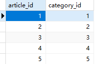

先看数据库表结构：



非常简单，只有文章id和栏目id，

根据你的描述，我理解你需要在后端和前端实现一些功能。下面是我对这些功能的理解：

|      | 从后端来看                                                   | 从前端来看                                                   |
| ---- | ------------------------------------------------------------ | ------------------------------------------------------------ |
| 增   | 需要一个方法，用于创建新的关联。这个方法需要接收一个参数列表，并返回一个特定格式的JSON对象。 | 需要一个界面，用户可以选择文章和栏目，然后创建新的关联。一个模态框，里面是一个下拉列表，包含了所有可用的栏目信息，选择好栏目后，出现所有可选的文章，以多选框的形式出现。选择好后，点击确定或取消。 |
| 删   | 需要一个方法，用于删除关联。这个方法应该接收一个Association实体类作为参数，然后删除相应的关联。 | 点击删除按钮后，用户可以选择一个关联并删除它。               |
| 改   | 需要一个方法，用于更新关联。                                 | 点击编辑按钮后，用户可以选择一个关联，然后更改它的栏目。     |
| 查   | 需要一个方法，用于查询关联。这个方法应该返回一个特定格式的JSON对象。还需要两个方法，分别用于查询所有可用的栏目和文章。 | 需要一个界面，用户可以查看所有的关联。还需要在创建新的关联时，可以查看所有可用的文章和栏目。 |

1. 查询关联列表，后端返回值格式：

   ```json
   [
       {
           "id": 1,
           {
           "articleId": 1,
           "title": "文章1",
       	},
       	{
           "categoryId": 1,
           "categoryName": "栏目1"
       	}
       },
       // ...
   ]
   ```
   查询所有可用栏目，需要一个参数：已选定的栏目id，以便在可用文章中排除已建立关联的文章。

   后端返回值格式：

   ```json
   {
       "categories": [
           {
               "categoryId": 1,
               "categoryName": "栏目1"
           },
           {
               "categoryId": 2,
               "categoryName": "栏目2"
           }
           // 更多栏目...
       ]
   }
   
   ```

   查询所有可用文章，后端返回值格式：

   ```json
   {
       "articles": [
           {
               "articleId": 1,
               "title": "文章1"
           },
           {
               "articleId": 2,
               "title": "文章2"
           }
           // 更多文章...
       ]
   }

2. 新增方法，只会出现一对多，或者一对一的形式，绝对不能多对多，那样数量就达到了笛卡尔积的程度。

   前端返回值格式：

   ```json
   {
       "selectedCategory": [
           {
               "categoryId": 1,
               "categoryName": "栏目1"
           },
       ],
       "selectedArticles": [
           {
               "articleId": 1,
               "title": "文章1"
           },
           {
               "articleId": 2,
               "title": "文章2"
           }
       ]
   }
   
   ```

3. 更新，使用常规Association实体类，包含id，文章id，和栏目id，只实现给文章换栏目的功能。

4. 删除，返回关联项的id即可，查询到即删除。

5. 同时要对Association实体类稍作修改，起码得加逻辑删除字段。

共计6个方法。
