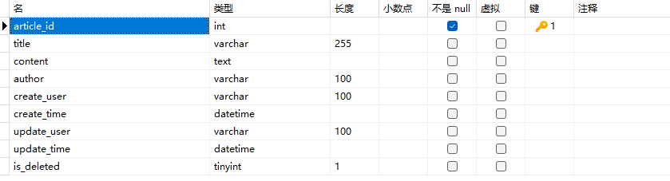

项目主体功能，实现文章的管理

对应数据库表结构：

基本功能：

|        | 从后端角度来看                  | 从前端角度来看                                               |
| :----- | :------------------------------ | :----------------------------------------------------------- |
| 增     | 在文章表中增加一行数据          | 在文章管理标签页中，点击新增按钮，弹出表单，填好相应信息后，向后端发送数据，然后自动刷新，该标签页的常规展示区自动显示相应项。可填项有：标题、内容、作者。 |
| 删     | （逻辑）删除一行数据            | 每行都有一个删除按钮，点击删除之后，会将含有文章id的信息发送至后端，然后自动刷新，该标签页的常规展示区该项自动消失。 |
| 改     | 改变文章内容、标题等            | 常规展示区内每行都有一个修改按钮，点击修改后，可改变文章的相关信息。采用表单修改。 |
| 分页查 | 查询所有逻辑删除字段为false的项 | 就是后台常规展示区的内容，可以在每次增删改后，自动刷新出最新数据。后台这里是返回内容摘要的。前台使用，返回完整内容，做展示 |

等等，似乎没有必要，完了做个缓存得了，只要实现分页查询就行。

文章管理后端初步完成——2024年1月8日16:18:23
