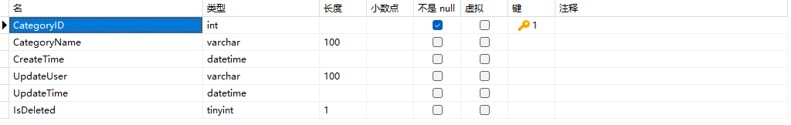

代表文章的不同分类

对应数据库表结构如下：

基本功能：

|      | 从后端角度来看                  | 从前端角度来看                                               |
| ---- | ------------------------------- | ------------------------------------------------------------ |
| 增   | 增加一行数据                    | 在栏目管理标签页中，点击新增按钮，弹出表单，填好相应信息后，向后端发送数据，然后自动刷新，该标签页的常规展示区自动显示相应项。 |
| 删   | （逻辑）删除一行数据            | 每行都有一个删除按钮，点击删除之后，会将含有栏目id的信息发送至后端，然后自动刷新，该标签页的常规展示区该项自动消失。 |
| 改   | 改变栏目名称                    | 常规展示区内每行都有一个修改按钮，点击修改后，可改变栏目名称。最好是在原处改动，不使用表单修改方式。 |
| 查   | 查询所有逻辑删除字段为false的项 | 就是常规展示区的内容，可以在每次增删改后，自动刷新出最新数据。 |

关于关联文章和栏目的问题，是把这个功能做在这里还是其他地方？如果是做在这个，这样就同时操作两张表了，对后端来说有点复杂。

不如在后端分开，在前端合起来。

详见：[[关联文章和栏目]]

栏目管理后端初步完成——2024年1月8日20:08:25

